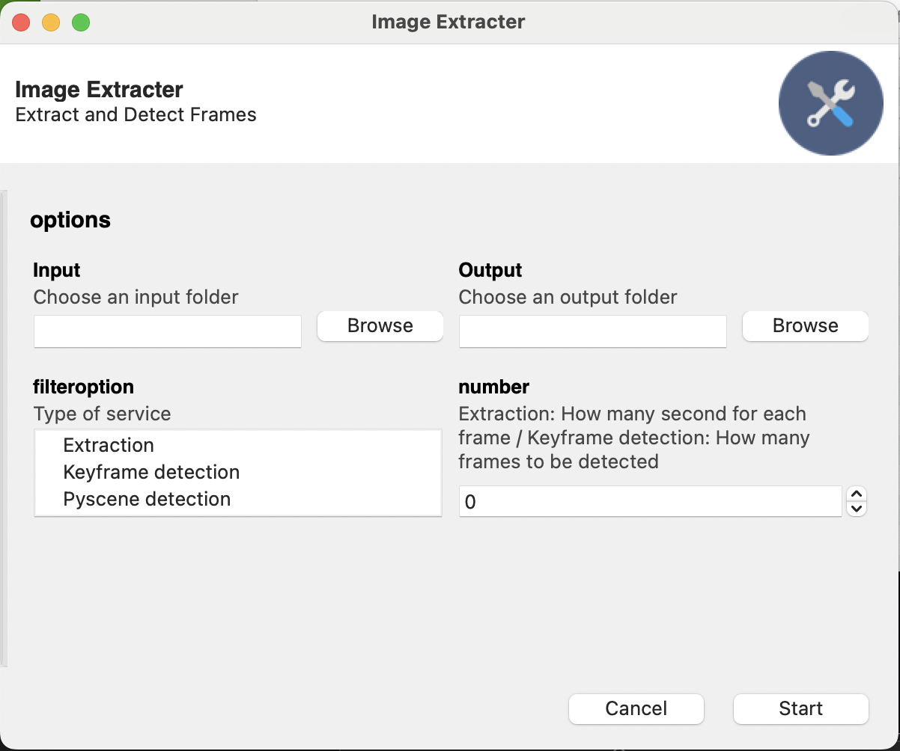

# AG Office
Our goal in this project was to implement a feature that turns vedios to images for a faster process. In this project we analyze three solutions such as constant extraction, keyframe detection and pyscene detection. In this GUI all the three solution has been implemented and tested.
* In the input box the user selects the folder that the vedios are located in
* In the output box the user selects the folder that would like the images to be saved in
* In the filter option box the user selects the type of solution that perefer for the input
* In the number box the user can selet the interval for each frame / Keyframe to be and for detection How many frames to be detected

## Setup Instructions
1) Clone the repository
2) Run pip3 install -r requirements.txt. This installs all the necessary libraries.
3) Run python3 Image Extraction.py